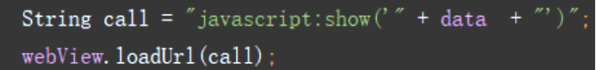

# Message Filter 垃圾短信过滤APP

## 中期
### 项目语言
+ web页面：html、css、JavaScript、JQuery、Bootstrap等
+ 安卓前端开发：java
+ 后端服务器：python（flask框架）

### 当前进度
1. 在Android Studio中，用WebView接口实现软件界面（AVD模拟器）显示html页面；
2. 用Android Studio中HttpClient API接口实现前端与后端服务器的链接；  

3. 点击页面按钮读取全部手机短信，短信数据从前端传到后端，等待处理；
4. 后端（Python Flask）接收短信数据，进行垃圾短信筛选，返回Json数据给前端：
    + 后端使用scikit-learn模块（数据挖掘和数据分析工具），通过其朴素贝叶斯算法API对短信数据进行垃圾短信的识别：
        + 导入中文垃圾短信数据集（80w数据 有垃圾短信和非垃圾短信）
        + 对中文短信进行分词（jieba）精确模式/全模式/搜索引擎模式的测试比较
        + 将分词后的数据集分隔成训练集和测试集：我们需要从训练集数据中产出学习器，再用测试集来测试所得学习器对新样本的判别能力（sklearn的train_test_split()函数）
        + 训练集文本特征提取：文本数据--->特征向量--->tf-idf矩阵
            + CountVectorizer(): 只考虑词汇在文本中出现的频率
            + TfidfVectorizer()：除了考量某词汇在文本出现的频率，还关注包含这个词汇的所有文本的数量。能够削减高频没有意义的词汇出现带来的影响, 挖掘更有意义的特征
        + 建立朴素贝叶斯分类器MultinomialNB()并进行训练
        + 利用测试集数据评估分类器
5. 前端通过WebView与JS交互，将垃圾信息数据显示在软件页面上:  
       
    图中通过javascript:将data数据传输到html里的show()函数

### 问题与思考
+ 垃圾信息数据集的80w数据在数量和质量上都有欠缺，筛选的精度有待提高，需要配合正则表达式等规则引擎增强筛选能力
+ 应满足用户设置黑名单的功能，应该如何实现？
    + 点击黑名单按钮时，应该还是将全部短信数据发送给后端，在后端进行黑名单的匹配，筛选来自黑名单号码的短信返回前端
    + 前端用户设定的黑名单电话簿应保存在手机本地还是数据库？如果存储在本地，则黑名版的匹配过程其实可以在前端用java实现；如果要保存在数据库，如何实现一用户一表格的匹配？（ip地址？用户登录？）
+ 朴素贝叶斯算法原理？

## 结项
>final-useful存储结项提交的内容
* 百度网盘已备份项目进程所有文件

### 技术要点
1. ListView+CheckBox
2. Fragment+ViewPager
3. Sqlite
4. Service
5. BroadcastReceiver
6. ContentProvider
7. Activity
